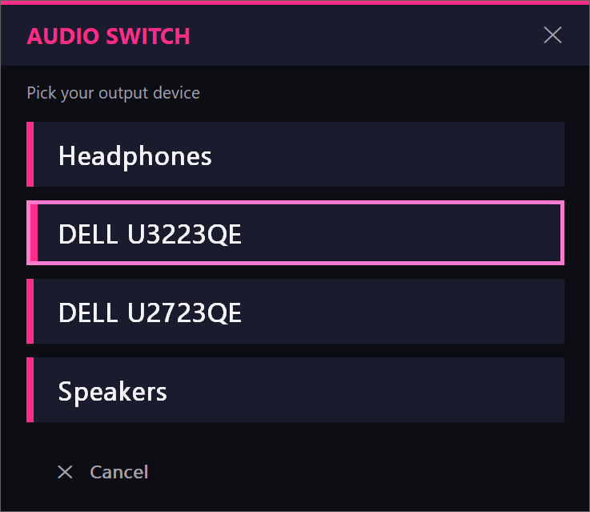

# 🎧 Audio Switch

**Swap your Windows default audio output with one hotkey.**

A tiny system-tray app that pops up a clean picker wherever your cursor is — hit a key, click a device, done. No more digging through Windows Sound settings to move audio between headphones, speakers, and monitors.

<p align="center">
  
</p>

---

## ⬇️ Download

**[Download AudioSwitch.exe →](https://github.com/mickeyperry/audio-switch/releases/latest/download/AudioSwitch.exe)**

One file, ~1.3 MB. No installer, no admin rights, no AutoHotkey needed — it's fully self-contained.

## 🚀 Install (10 seconds)

1. Download **`AudioSwitch.exe`** and drop it anywhere (Desktop, a tools folder, wherever).
2. Double-click it. A headphone icon appears in your system tray.
3. Press **`F12`** — the picker pops up at your cursor. Click an output device.
4. Right-click the tray icon any time for **Settings**, **About**, or **Exit**.

## ✨ Features

- **One global hotkey** — switch outputs without leaving your game, call, or DAW. The picker comes to your cursor, on top of everything.
- **Your shortcut, your call** — rebind it to any combo (`Ctrl`+`Alt`+`S`, a spare function key, whatever) in Settings.
- **Lives in the tray** — clean headphone icon; right-click for Settings / About / one-click Exit.
- **Draggable & glowing** — move the window by its header, cards glow on hover, and pulse when clicked.
- **Starts with Windows** — flip one switch in Settings and it's armed every time you log in.
- **Truly standalone** — a single `.exe`. No install, no AutoHotkey, no admin. Copy it to any Windows 10/11 PC and run.

## ⚙️ Settings

Open from the tray icon → **Settings…**

- **Shortcut** — tick modifiers (Ctrl / Alt / Shift / Win) + pick a key. Default is `F12`.
- **Start automatically with Windows** — adds/removes a Startup shortcut.

Config is stored at `%AppData%\AudioSwitch\settings.ini`.

## 🛠️ How it works

Audio Switch reads your active render (output) devices from the registry and switches the default endpoint using the same Windows `IPolicyConfig` COM interface the system sound flyout uses — so it's instant and needs no elevation.

## 🧰 Build from source

The app is a single [AutoHotkey v1.1](https://www.autohotkey.com/) (Unicode) script, `AudioSwitch.ahk`.

- **Run directly:** install AutoHotkey v1.1 and double-click the `.ahk` (keep `AudioSwitch.ico` next to it).
- **Compile to a standalone `.exe`:** with [Ahk2Exe](https://github.com/AutoHotkey/Ahk2Exe):
  ```
  Ahk2Exe.exe /in AudioSwitch.ahk /out AudioSwitch.exe /icon AudioSwitch.ico /base AutoHotkeyU64.exe
  ```
  (Keep the `.ahk` saved as UTF-8 **with BOM** so the glyphs render correctly.)

## 📋 Requirements

- Windows 10 or 11
- At least one audio output device

## 📄 License

[MIT](LICENSE) — free, forever. Made by [Mickey Perry](https://mickeyperry.github.io/).
